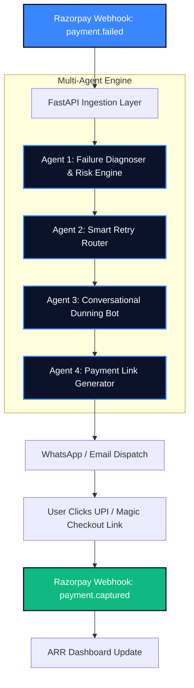
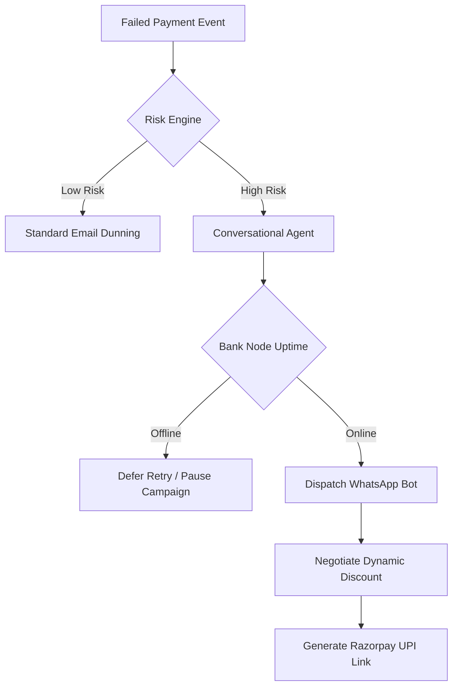

# SmartRecovery Assistant 🚀

An end-to-end AI-powered autonomous multi-agent pipeline designed specifically for Razorpay Merchants. SmartRecovery intercepts failed payment webhooks and triggers a coordinated swarm of AI agents to diagnose errors, optimize retries, and recover lost ARR through conversational dunning and dynamic discount incentives.

## 1. System Design 🏛️

The system consists of a Vite/React frontend dashboard communicating with a FastAPI backend server. The backend runs an LLM-powered multi-agent router that utilizes specialized agents for failure diagnosis, uptime scheduling, and Groq-powered conversational AI.



**System Data Flow:**

- **Webhook Ingestion:** The backend intercepts a `payment.failed` POST request from the Razorpay Gateway.
- **Diagnosis & Risk:** Agent 1 parses the error code and calculates a dynamic churn Risk Score deterministically based on transaction volume and plan tier.
- **Routing & Scheduling:** Agent 2 checks simulated bank node uptimes to defer retries if necessary, preventing redundant decline fees.
- **AI Dunning Strategy:** Agent 3 (Conversational Bot powered by Groq `llama3`) adopts a support persona to engage the user via WhatsApp/Email, dynamically offering tiered discounts (like `REV5OFF`).
- **Payment & Dashboard Update:** Agent 4 generates an instant 1-Tap UPI Intent or Magic Checkout link. Once paid, the frontend Command Center Dashboard is instantly updated via the state manager.

## 2. Agent Design & Logic 🧠



### 📂 Project File Structure

```text
ai-revenue-recovery-agent/
├── app/                      # FastAPI backend
│   ├── api/
│   │   ├── routes/
│   │   │   ├── chat.py       # Conversational Dunning Agent (Groq AI)
│   │   │   ├── legacy_ui.py  # Core state & Risk Scoring Engine
│   │   │   └── webhooks.py   # Webhook ingestion & Simulator endpoints
│   ├── core/                 # App configuration
│   ├── schemas/              # Pydantic data validation models
│   ├── services/             # Background multi-agent orchestrator logic
│   └── main.py               # FastAPI App entrypoint
├── frontend/                 # React/Vite Dashboard UI
│   ├── src/
│   │   ├── components/       # Dashboard, Simulator, Mock Checkout UI components
│   │   ├── App.jsx           # Main UI Router
│   │   └── main.jsx          # React DOM entrypoint
│   ├── index.html            # Global HTML entrypoint
│   └── package.json          # Node dependencies
├── db.json                   # Local persistent JSON database for telemetry state
├── .env                      # Environment variables (Groq API Key)
└── requirements.txt          # Python dependencies
```

## 🌟 Key Features

**1. Multi-Agent Orchestration Architecture**
Instead of a single monolithic script, the system delegates recovery tasks to specialized sub-agents: Diagnoser, Scheduler, Conversational Bot, and Link Dispatcher. We get the best of both worlds: deterministic routing combined with human-like conversation.

**2. Dynamic Risk Scoring Engine**
Calculates a 0-100 customer churn probability based on deterministic metrics: Failure Root Cause, Subscription Plan Tier (Enterprise vs. Basic), and Transaction Amount. High-risk customers are automatically escalated to conversational agents.

**3. Ultra-Fast Groq Conversational Dunning**
Replaces rigid email blasts with interactive WhatsApp AI chats. Powered by Groq's high-speed LLM inference, the bot negotiates with users, overcomes objections, and issues dynamic promo codes in real-time.

**4. Uptime-Aware Smart Retries**
Reduces redundant gateway decline fees by deferring automatic payment retries during active bank node downtimes.

**5. Enterprise Command Center Dashboard**
A fully responsive, dark-mode terminal layout featuring real-time Recharts telemetry, agent subsystem status monitors, and root-cause failure distribution charts.

## 🛠️ Technology Stack

- **Frontend:** React, Vite, CSS Grid/Flexbox, Recharts, Lucide Icons
- **Backend:** FastAPI (Python), Uvicorn, JSON DB
- **Agent Framework:** Custom Multi-Agent Pipeline
- **LLM Provider:** Groq (`llama3` model family)
- **Data & Parsing:** Pydantic validation, Razorpay Webhooks

## 🚀 Local Installation & Running Instructions

**Prerequisites**
- Node.js (v18+)
- Python (3.10+)
- A valid Groq API Key

**1. Environment Configuration**
Create a `.env` file in the root directory and add your Groq API Key:
```env
GROQ_API_KEY=gsk_your_groq_api_key_here
```

**2. Boot the Backend**
Install the Python dependencies and start the FastAPI server:
```bash
pip install -r requirements.txt
uvicorn app.main:app --reload --port 8000
```
*Note: The backend will be available at http://localhost:8000.*

**3. Boot the Frontend**
Open a new terminal, navigate to the frontend directory, install dependencies, and start the Vite dev server:
```bash
cd frontend
npm install
npm run dev
```
*Note: The frontend will be available at http://localhost:5173.*

## 🧪 Testing and Evaluation

**1. Live Webhook Simulator Test**
- Open the dashboard at `http://localhost:5173`.
- Click the **INJECT FAILURE EVENT** button on the left sidebar to send a mock Razorpay `payment.failed` webhook.
- Watch the Risk Scoring engine update the Telemetry Chart instantly.

**2. Conversational Agent Test**
- Navigate to the **Active Campaigns** tab.
- Click the **WhatsApp icon** on a high-risk failure to open the Chat Simulator.
- Chat with the Groq AI agent, negotiate a discount, and click the generated Razorpay Magic Checkout link to recover the revenue!
